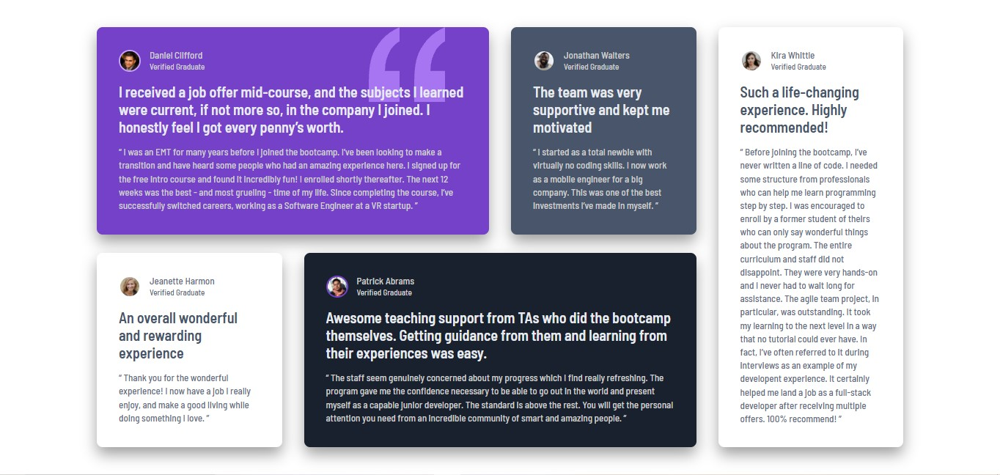

## Welcome! 👋

Thanks for checking out this front-end coding challenge.

[Frontend Mentor](https://www.frontendmentor.io) challenges help you improve your coding skills by building realistic projects.

**To do this challenge, you need a basic understanding of HTML and CSS.**

Your challenge is to build out this testimonials grid section and get it looking as close to the design as possible.

You can use any tools you like to help you complete the challenge. So if you've got something you'd like to practice, feel free to give it a go.

Your users should be able to:

- View the optimal layout for the site depending on their device's screen size

## My Solution
### Screenshot (Desktop)

### Screenshot (Mobile)

## Build with

* HTML5 markup,
* CSS custom properties,
* CSS Grid

This challenge is completely free. Please share it with anyone who will find it useful for practice.
📩 We love receiving feedback! If you have anything you'd like to mention, please email: as440.nurullah@gmail.com

Thanks for everything

## Author

Profile: https://www.frontendmentor.io/profile/nurullahbss
